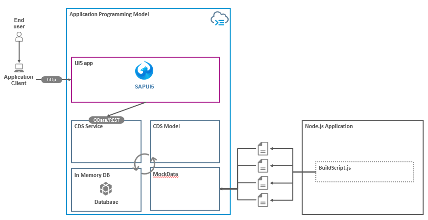

# UI5 Overview

## :warning: Getting Started

Please follow this setup guide in order to have all the tools required on your machine :computer: for this training

[Getting Started Guide](GettingStarted.md)

## Welcome to your new project

### Architecture



> This learning material is a focus on the UI5 app. Other parts will be ignored on purpose.

It contains at least these folders and files, following the recommended SAP project layout:

| File / Folder  | Purpose                              |                                              |
| -------------- | ------------------------------------ | -------------------------------------------- |
| `app/`         | content for UI frontends go here     | **what we will edit in this session**        |
| `db/`          | your domain models and data go here  | _comes prefilled for this learning material_ |
| `srv/`         | your service models and code go here | _comes prefilled for this learning material_ |
| `package.json` | project metadata and configuration   | _comes prefilled for this learning material_ |

## Diving into UI5

### :notebook: THE Guide

The link below shall be your bible.
Everything you need or will need for this training or later is in this website  
[The SDK](https://sapui5.hana.ondemand.com/)

So let's take a minute or two to look what it contains.

### The MVC principle


**Model**: This is the part that is accountable for the management, retrieval, and updating of the data that is being viewed in your application.

**View**: This part is accountable for interpreting and rendering the initial UI. The view in the context of SAPUI5, generates the presentation to the user based on changes in the model.

What does a view look like? Well, in its directory, views are in stored in the `view` folder and names of XML views always end with **\*.view.xml** (as you'll see later).

**Controller**: This is one of the most important parts.  
This is the part that is accountable for separating the view logic from the data logic.  
The Controller responds to **user interaction** and **view events** by adjusting the view and the model. The controller is essentially sending commands to the model to update it's state, like editing a document in a word processing application.  
Similar to views, controllers carry the same name as the related view (if there is a 1:1 relationship).  
Controller names always end with **\*controller.js** (as you'll see below).

## Building our app

-   [HelloWorld](Helloworld.md)
-   [Binding](Binding.md)
-   [OData Binding](ODataBinding.md)
-   [Navigate](Navigate.md)

> Every learning material has a dedicated branch containing the final solution of each topic

```sh
#For helloworld final content
> git checkout --track --origin/helloworld
#--------

#For binding final content
# Part1
> git checkout --track --origin/binding
# Part2
> git checkout --track --origin/odatabinding
#--------

#For navigation final content
> git checkout --track --origin/navigation
#--------
```
